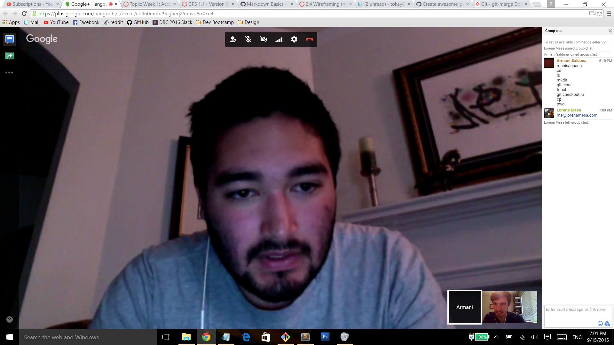

**cd** *change directory*
**ls** *list directory*
**mkdir** *make directory*
**git clone** *copy repo from remote to local*
`touch create empty file`
`git checkout -b creates and switches to new` 
[branch](https://google.com)
cp copy
pwd print working directory

